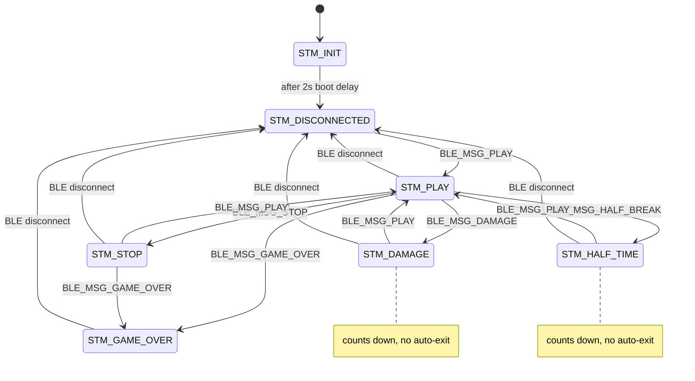

# 04 — State Machine

Implemented in `state_machine.cpp` / `state_machine.h`. The active state is a single
`static stm_states current_state` plus a `static bool state_changed` one-shot flag.

## States (`stm_states` enum)

| State | Value | Entered by | Output pins | Display |
|-------|-------|-----------|-------------|---------|
| `STM_INIT` | 0 | initial value at boot | (unchanged) | boot logo + version, then `delay(2000)` → `STM_DISCONNECTED` |
| `STM_DISCONNECTED` | 1 | boot, or BLE disconnect | LOW (via state-change) | "Wait for connection" (QR + MAC) |
| `STM_PLAY` | 2 | `BLE_MSG_PLAY` | **HIGH** | PLAY screen (indicator + score) |
| `STM_STOP` | 3 | `BLE_MSG_STOP` | LOW | STOP screen |
| `STM_DAMAGE` | 4 | `BLE_MSG_DAMAGE` | LOW | PENALTY + countdown |
| `STM_HALF_TIME` | 5 | `BLE_MSG_HALF_BREAK` | LOW | HALFTIME + countdown |
| `STM_GAME_OVER` | 6 | `BLE_MSG_GAME_OVER` | LOW | GAME OVER + score |
| `STM_UPDATING` | 7 | **nothing (unused)** | — | none (no handler) |

> `STM_UPDATING` is declared but never set or handled. Likely reserved for an OTA/flashing
> screen. Safe to ignore today; do not assume it is reachable.

## Output pin behavior

`update_output_satet()` (note: misspelled "satet") is called by `stm_update()` **only when
`state_changed` is true**:

```c
robot_play ? (OUT1=HIGH, OUT2=HIGH, Serial "PLAY") : (OUT1=LOW, OUT2=LOW, Serial "STOP")
```

`robot_play` is set per state handler: `true` only in `state_play()`; `false` in
`state_stop()`, `state_damage()`, `state_half_break()`, `state_game_over()`.
`STM_INIT` and `STM_DISCONNECTED` do not set `robot_play` themselves — its value persists,
but on the **transition into** `STM_DISCONNECTED` the previous handler had already set it
`false` (or it is `false` from boot), so outputs are effectively LOW when disconnected.

## Per-loop rendering vs change-gated rendering

`stm_update()` runs every loop. Important asymmetry:

| State | Re-renders... |
|-------|---------------|
| `STM_INIT` | every loop (calls `state_init()` unconditionally → but transitions away after first run) |
| `STM_DISCONNECTED` | **only when `state_changed`** (`if (state_changed) state_wait_connecting();`) |
| `STM_PLAY`, `STM_STOP`, `STM_DAMAGE`, `STM_HALF_TIME`, `STM_GAME_OVER` | **every loop** |

Consequences:
- The penalty/halftime **countdown updates live** because those screens redraw each loop
  and recompute `get_remaining_time()`.
- A `SET_SCORE` / `SET_NAME` received while in `STM_DISCONNECTED` is stored but not drawn
  until a state change forces a redraw.

## Timer behavior

- `stm_set_timer(ms)` sets `timer_stop = millis() + ms`.
- `get_remaining_time()` returns `max(0, (timer_stop - millis())/1000)` seconds.
- `BLE_MSG_DAMAGE` and `BLE_MSG_HALF_BREAK` set the timer (big-endian uint32 ms) **then**
  switch state; the screen counts down to 0.
- **The firmware does NOT auto-transition when the timer reaches 0.** It only displays `0`.
  Resuming play requires the app to send `BLE_MSG_PLAY` (or `STOP`). Putting robots back is
  a referee/team action per the rules (public README), not an automatic firmware event.

### The `660000 ms` init timer (unexplained)

```c
int8_t stm_init() {
    stm_set_timer(660000); //DOTO why ist here this? WTF
    return ESP_OK;
}
```

- 660000 ms = **11 minutes**. The author's own comment questions why it is there.
- It is harmless unless a `STM_DAMAGE`/`STM_HALF_TIME` screen is somehow shown before any
  `BLE_MSG_DAMAGE`/`HALF_BREAK` arrives (those messages overwrite the timer anyway).
- **Do not "fix" this without understanding intent** — flagged as an open question.

## Transition triggers summary

| Trigger | Resulting state |
|---------|-----------------|
| Boot | `STM_INIT` → (after 2 s) `STM_DISCONNECTED` |
| BLE `onDisconnect` | `STM_DISCONNECTED` (+ advertising restarts) |
| `BLE_MSG_PLAY` | `STM_PLAY` |
| `BLE_MSG_STOP` | `STM_STOP` |
| `BLE_MSG_DAMAGE` | `STM_DAMAGE` (timer set first) |
| `BLE_MSG_HALF_BREAK` | `STM_HALF_TIME` (timer set first) |
| `BLE_MSG_GAME_OVER` | `STM_GAME_OVER` (scores set first) |

> Note: BLE **connect** does NOT change state (the `stm_set_state(STM_PLAY)` line in
> `onConnect` is commented out). After connecting, the module stays on the
> "Wait for connection" screen until the app sends an explicit command.

## Disconnect behavior

`MyServerCallbacks::onDisconnect` (BLE host context):
1. `device_connected = false`
2. `stm_set_state(STM_DISCONNECTED)`
3. Restart advertising.

On the next `stm_update()` the disconnected screen is drawn and outputs go LOW
(robot stops). The 5-second button-hold `ble_disconnect()` path additionally sends a
`BLE_MSG_DISCONNECT` notification to the app first, then calls `pServer->disconnect(...)`,
which routes through the same `onDisconnect`.

## Game over

`STM_GAME_OVER`: outputs LOW, screen shows final `score` (large) and `indicator` (small).
No automatic exit; stays until disconnect or a new command.

## Mermaid diagram


*(Any state can be driven to any other by the app; only the common edges are shown.)*

## Suspicious / noteworthy comments

- `state_machine.cpp:88` — `//DOTO why ist here this? WTF` on the `660000` init timer.
- `update_output_satet` — function name typo (cosmetic).
- `ble.cpp` `onConnect` — `//stm_set_state(STM_PLAY);` commented out.

## Source files reviewed

`state_machine.cpp/.h`, `ble.cpp`, `ble_processing.cpp`, `display.cpp`.

## Open questions

- Intended purpose of the `660000 ms` timer in `stm_init()`.
- Should the penalty/halftime timer auto-return to `STM_PLAY`/`STM_STOP` at 0, or is the
  app always responsible?
- Should `STM_DISCONNECTED` redraw on score/name updates (currently it does not)?
</content>
